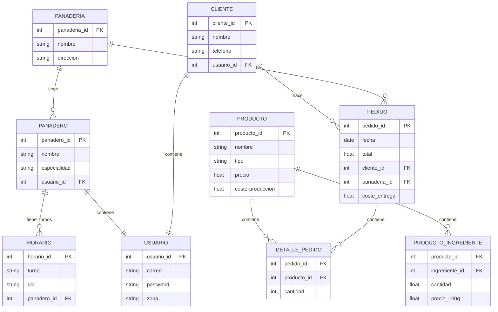

```mermaid
erDiagram
    USUARIO{
        int usuario_id PK
        string correo
        string password
        string zona

    }
    PANADERIA {
        int panaderia_id PK
        string nombre
        string direccion
    }

    PANADERO {
        int panadero_id PK
        string nombre
        string especialidad
        int usuario_id FK
    }

    HORARIO {
        int horario_id PK
        string turno
        string dia
        int panadero_id FK
    }

    PRODUCTO {
        int producto_id PK
        string nombre
        string tipo
        float precio
        float coste-produccion
    }


    PRODUCTO_INGREDIENTE {
        int producto_id FK
        int ingrediente_id FK
        float cantidad
        float precio_100g
    }

    PEDIDO {
        int pedido_id PK
        date fecha
        float total
        int cliente_id FK
        int panaderia_id FK
        float coste_entrega
    }

    CLIENTE {
        int cliente_id PK
        string nombre
        string telefono
        int usuario_id FK
    }

    DETALLE_PEDIDO {
        int pedido_id FK
        int producto_id FK
        int cantidad
    }

    %% --- RELACIONES ---

    %% 1:1
    PANADERIA ||--o{ PANADERO : tiene

    %% 1:N
    PANADERO ||--o{ HORARIO : tiene_turnos

    %% 1:N
    CLIENTE ||--o{ PEDIDO : hace

    %% 1:N
    PANADERIA ||--o{ PEDIDO : recibe

    %% N:M
    PRODUCTO ||--o{ PRODUCTO_INGREDIENTE : contiene
    PRODUCTO ||--o{ DETALLE_PEDIDO : contiene
    PEDIDO ||--o{ DETALLE_PEDIDO : contiene
    PANADERO ||--|| USUARIO : contiene
    CLIENTE ||--|| USUARIO : contiene
```